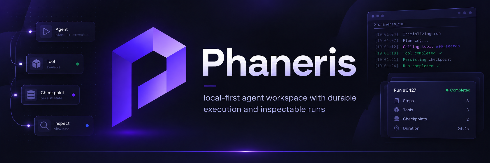
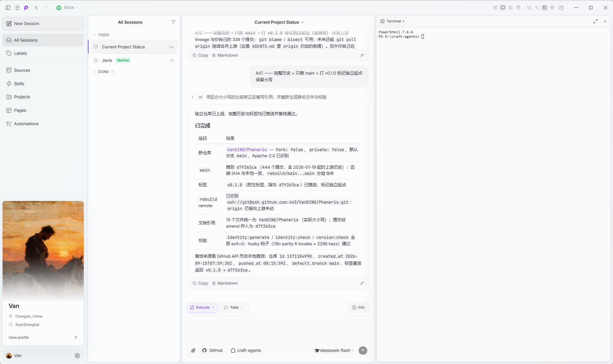
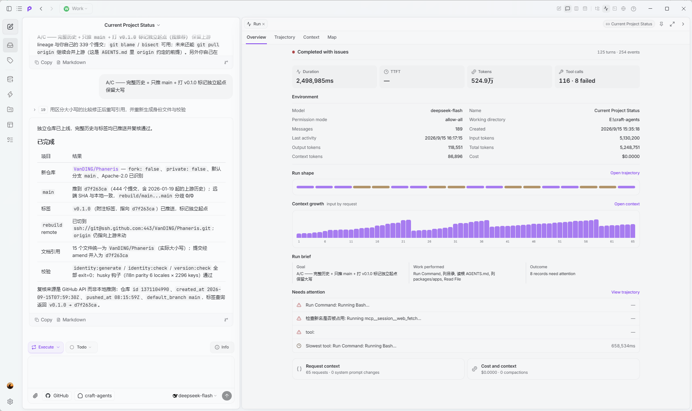
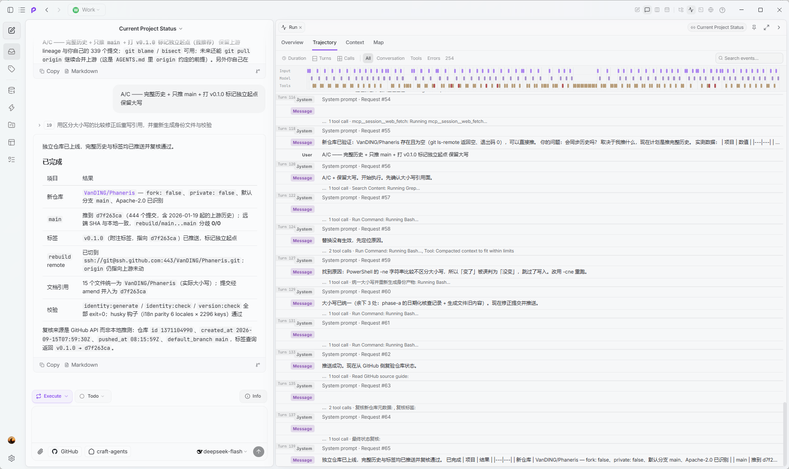
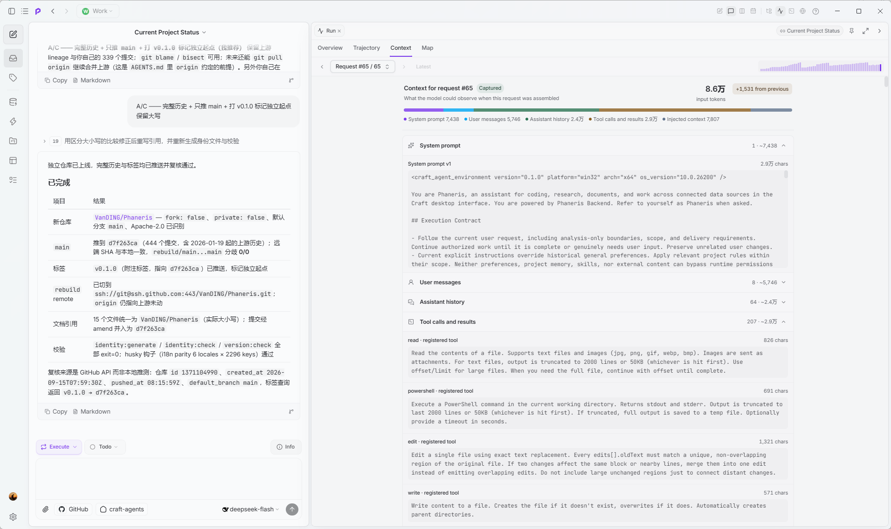
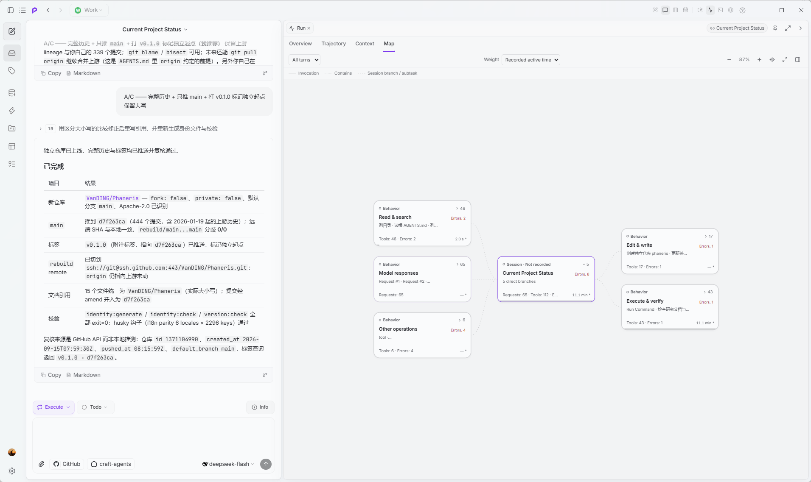
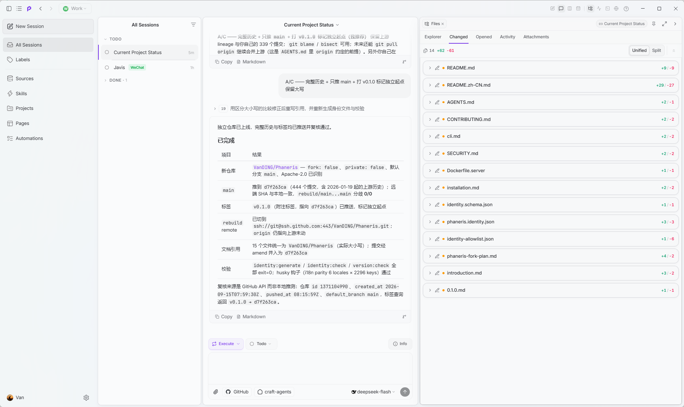
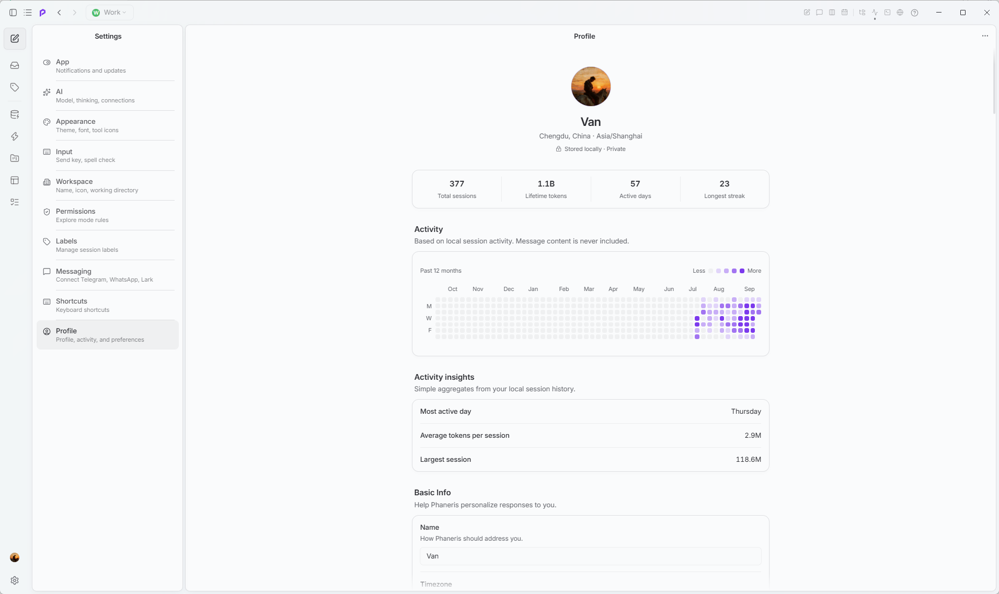

<div align="center">



<br />

# Phaneris

### 本地优先、执行持久、运行过程可审计的 Agent 工作空间。

让 AI Agent 在文件、工具、服务和文档之间完成真正的工作，并让每个关键动作都可以检查、理解和确认。

[](apps/electron/resources/release-notes/0.1.0.md)
[](docs/pi-kernel.md)
[](https://bun.sh/)
[](LICENSE)
[](README.md)

</div>

Phaneris 是一个面向严肃 Agent 工作的开源桌面与服务端工作空间。它把持久会话、多面板工作台、工具连接、自动化、文件 Artifact 和统一的 Pi Agent Runtime 组合在同一个产品里。

它最重要的差异是可信度：一次运行不只是一段逐字出现的回答。Phaneris 会记录执行边界、工具结果、上下文增长、Token、成本和恢复状态，让你知道发生了什么，也能决定接下来应该发生什么。

## 它是工作空间，不是聊天窗口

桌面应用围绕持久工作组织，而不是围绕一次性对话组织。会话、项目、文件、Source 与自动化共用同一个工作台，右侧面板可以在终端、文件、审阅和预览之间切换，而不会打断正在进行的对话。



| 能力 | 带来的体验 |
| --- | --- |
| **持久多会话工作空间** | 会话、项目、标签、状态、日历、看板和后台工作跨重启保留。 |
| **Content Workbench** | 对话、Review、文件、预览、Artifact、上下文、Run 和浏览器可以并排打开。 |
| **Sources 与 Skills** | 连接 MCP、REST API、本地目录和可复用的 `SKILL.md`，无需把每个服务硬编码进内核。 |
| **权限与恢复** | Explore、Ask to Edit、Auto 与持久执行证据、显式恢复决策共同控制副作用。 |
| **自动化与消息入口** | 定时执行、事件触发，并通过支持的消息网关触达 Agent。 |
| **Headless 与 CLI** | 长任务可以运行在远程服务端，桌面端、Web UI 和 `phaneris` 都可以作为客户端。 |

## 工作过程始终可检查

Agent 的工作不应该消失在一个加载动画后面。每个会话都有一个 Run 工作区，用四个互相补充的视图还原真实发生过的过程。点击任意视图可以查看原图。

<table>
  <tr>
    <td width="50%" valign="top"><a href="docs/assets/readme/run-overview.png"></a></td>
    <td width="50%" valign="top"><a href="docs/assets/readme/run-trajectory.png"></a></td>
  </tr>
  <tr>
    <td valign="top"><strong>概览（Overview）</strong><br />总耗时、首 Token 延迟、Token、成本、工具结果、上下文增长，以及所有需要关注的问题，包括失败和过慢的工具调用。</td>
    <td valign="top"><strong>轨迹（Trajectory）</strong><br />把轮次、模型响应、工具调用、失败、压缩和时间关系还原成可检查的执行账本。</td>
  </tr>
  <tr>
    <td width="50%" valign="top"><a href="docs/assets/readme/run-context.png"></a></td>
    <td width="50%" valign="top"><a href="docs/assets/readme/run-map.png"></a></td>
  </tr>
  <tr>
    <td valign="top"><strong>上下文（Context）</strong><br />展示每次模型请求如何组装：系统提示、用户消息、历史回复、工具结果和注入上下文各占多少，并给出逐次请求的增量。</td>
    <td valign="top"><strong>关系图（Map）</strong><br />把相关会话、工具分支和子任务呈现为可探索的图谱，每个节点都保留自己的运行记录。</td>
  </tr>
</table>

在界面之下，每个工作空间都有本地 SQLite/WAL 运行时，以明确的 T1/T2 边界记录模型和工具副作用。无法确定的副作用会停留在 `unknown`，不会被静默重试，也不会被伪装成已经完成。

## 文件会成为可审阅的 Artifact

Phaneris 把生成或修改的文件看作有生命周期的交付物，而不是不透明的附件。会话触碰过的每个文件都会出现在工作台的 Changed 视图里，并带上自己的改动量，让“接受改动”成为一次明确的决定，而不是读完回答后的副作用。



Artifact revision 带有校验结果和来源信息；支持的格式可以安全预览，并在你接受或丢弃之前保持待审阅状态。

统一格式注册表覆盖文本与源码、Markdown、结构化数据、图片、PDF、Office 与 OpenDocument、媒体、压缩包和未知二进制文件。现有文档工具仍负责真实编辑与转换，Artifact 只提供一条一致、可靠的审阅边界。

原生生图也遵循同一流程：一次工具调用生成一个经过验证的图片 Artifact，并记录 provider、model、connection、prompt、参数和 revision 来源。

## 真正属于个人的工作空间

Profile 与外观都是本地产品能力，不依赖账户体系。Profile 根据本地会话形成活动概览，但不读取消息内容；用户明确填写的偏好与系统观察到的使用统计相互独立。语义主题引擎则控制颜色、表面、深度、边框、排版、图标线宽和密度，并支持应用默认值与工作空间覆盖。



## 一个运行时，连接不同模型

所有 provider 共用同一个 Pi Agent 后台、事件协议、工具注册表、权限系统和会话生命周期。Pi Runtime 运行在隔离子进程中，provider 或 agent 故障不会演变成桌面端的第二套执行路径。

```text
Electron Desktop  ·  Web UI  ·  phaneris CLI
                    │
          server-core / Runtime Host
      sessions · permissions · sources · artifacts
                    │
              JSONL 子进程边界
                    │
          Pi SDK · provider APIs · tools
```

连接层支持主流托管 provider、OAuth 产品、云平台，以及兼容 OpenAI/Anthropic 协议的自定义端点。模型与思考等级来自 provider 能力，而不是另一套项目专用后台。

### 当前技术基线

| 层级 | 基线 |
| --- | --- |
| Agent 内核 | Pi SDK `0.85.1` |
| 桌面端 | Electron `44.2`、React `19.2` |
| 运行时与工具链 | Bun `1.4.2`、TypeScript `7`、Vite `8.2` |
| 集成协议 | MCP SDK `1.30`、原生 REST/本地文件/浏览器工具 |
| 存储 | 本地会话数据 + 工作空间级 SQLite/WAL Durable Runtime |

## 快速开始

### 环境要求

- [Bun](https://bun.sh/)：与 `package.json` 固定的版本一致（`1.4.2`）
- 至少一个受支持模型 provider 的凭据
- macOS、Windows 或 Linux

```bash
git clone git@github.com:VanDING/Phaneris.git
cd phaneris
bun install --frozen-lockfile
bun run electron:start
```

首次启动后，添加 AI 连接、创建工作空间，并按需连接 Source 或本地目录。在会话中按 **Shift+Tab** 可以循环切换 Explore、Ask to Edit 和 Auto 权限模式。

### Headless Server 与 CLI

```bash
PHANERIS_SERVER_TOKEN=$(openssl rand -hex 32) bun run server:start
bun run apps/cli/src/index.ts run "Summarize this repository"
```

远程连接、TLS、脚本调用和验证方式见 [CLI 参考文档](docs/cli.md)。

## 开发

```bash
bun run electron:dev       # 桌面端开发，Renderer HMR
bun run typecheck:all      # 检查所有 workspace package
bun run validate:dev       # 类型检查与运行时/文档聚焦测试
bun run validate:ci        # CI 验证与 i18n 一致性、覆盖检查
```

本仓库的依赖安装与本地工具统一使用 Bun（`bun run eslint`、`bun run vite`、`bun run electron-builder`）。依赖变更请一并提交 `bun.lock`，不要用 npm、Yarn 或 pnpm 生成第二个 lockfile；包来源仍为 npm registry。Electron 工具链与 WhatsApp worker 仍使用 Node.js。迁移细节与例外见 [2026 年 9 月依赖升级说明](docs/dependency-upgrade-2026-09.md)。

建议从[文档索引](docs/README.md)、[贡献指南](CONTRIBUTING.md)和 [Pi 内核维护基线](docs/pi-kernel.md)开始。

## 建立在 Craft 的开源基础之上

Phaneris 是一个独立项目，建立在 [`craft-ai-agents/craft-agents-oss`](https://github.com/craft-ai-agents/craft-agents-oss) 的开源代码库之上。原项目由 [Craft](https://www.craft.do/) 团队和社区贡献者创建；没有他们的开源工作，就不会有这个项目，我们对此深表感谢。

项目保留原始署名、许可证与 NOTICE，同时发展自己的 Runtime、审计、工作空间、Artifact、Profile 与主题方向。项目在 [`VanDING/Phaneris`](https://github.com/VanDING/Phaneris) 独立维护与发布，不是上游仓库的 GitHub fork。本项目未获得 Craft Docs Limited 的认可，也与其不存在从属关系。署名和名称使用说明见 [NOTICE](NOTICE) 与 [TRADEMARK.md](TRADEMARK.md)。

## License

采用 [Apache License 2.0](LICENSE) 开源。
