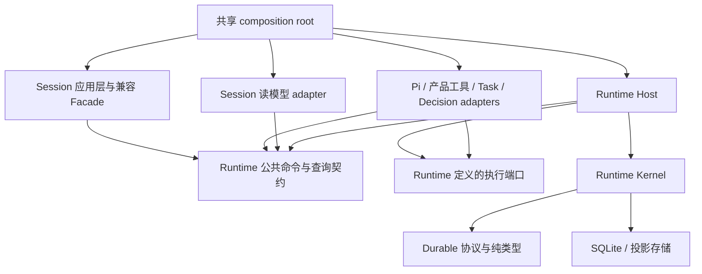

# 让 Durable Runtime 拥有自己的边界

Status: Accepted — B0–B5 的模块边界和生产接线已实施；沿用已接受的持久化协议。验收范围和结果见第 12 节。

日期：2026-10-10。源码基线：`dbd32f60b5d90e20b1bc2b231035baf6b171ddc2`。

本设计重新划分 **Durable Runtime 与 SessionManager 的所有权和依赖边界**。成功标准是 Runtime 的执行、恢复与记账可以独立演进；文件数量和行数只是结果。

配套：[实施前故障矩阵及覆盖记录](../verification/durable-runtime-boundary-failure-matrix.md)、[验收产物与重跑说明](../verification/results/durable-runtime-boundary/README.md)。

## 1. 决策摘要

采用“**事务内核 + 执行宿主 + 外部适配器**”的边界，保留 SessionManager 的产品入口兼容性。

| 边界 | 唯一负责的事情 | 不应承担的事情 |
| --- | --- | --- |
| Runtime Kernel，事务内核 | operation、T1/T2、身份与参数一致性、恢复裁决、usage、canonical context | 会话标题、UI 消息对象、TaskRunner DAG、Pi 进程、权限弹窗 |
| Runtime Host，执行宿主 | 输入交付、前台运行槽位、agent 驱动、取消、结束收敛、运行资源生命周期 | 产品元数据持久化、窗口路由、任务编排策略、决策 feature 策略 |
| Adapters，外部适配器 | Pi 接线、产品工具与权限交互、会话读模型、任务事实映射、决策/图像调用 | 独立推进 durable program counter、凭缓存判定副作用未发生 |
| Session 应用层 | 会话创建与组织、用户设置、标题/标签/已读、附件和交接文档、RPC 兼容入口 | 持有另一份活动 run、消费 agent 主循环、直接操作 Runtime Store |

这不是新建一个包裹全部逻辑的 `DurableExecutionService`。现有 `DurableRuntimeCoordinator` 已经是可复用的事务内核基础；新增的关键能力是**完整且单一的执行所有者，以及不可绕过的公共接口**。

第一阶段保持同进程、现有 SQLite/WAL、Pi JSONL 协议和包布局。新的 npm 包、独立服务进程、分布式调度都不是建立这条边界的前提。

| 可选方案 | 判断 |
| --- | --- |
| 按九服务移动方法，共享 ManagedSession | 能降低文件长度，但执行所有权与回调环不变；不作为本次方案 |
| 只封装 Coordinator，主循环继续留在 SessionManager | 可作为第一步，不能作为完成状态；后续取消、输入和恢复策略仍受 SessionManager 控制 |
| 同进程 Kernel + Host，产品通过明确 adapter 接入 | 采用；能保留既有事务/SDK资产，并分别验证内核与完整执行边界；代价是必须逐条迁移状态与回调 |
| 立即拆包或拆进程 | 暂缓；会同时引入构建、协议与部署变化，且无法自动解决所有权问题 |

Host 只负责驱动和监督现有 backend。Pi SDK 继续承担自己的模型—工具循环，本次不在 Host 内重写第二套 agent loop。

## 2. 实施前基线：已有独立模块，缺少完整执行边界

行数按本次工作树逐行统计：`SessionManager.ts` **11,502** 行，`pi-agent.ts` **3,533** 行，`coordinator.ts` **1,242** 行，`store.ts` **1,032** 行。旧讨论中的 10,473 行及旧规划中的 11,385 行不作为实施基线。

下面的行号仅用于定位上述提交；函数名比行号更稳定。

| 已核实的事实 | 源码定位 | 架构含义 |
| --- | --- | --- |
| Coordinator 不 import SessionManager；已有直接构造 Coordinator 的真实进程崩溃测试 | [coordinator.ts](../../packages/server-core/src/durable-runtime/coordinator.ts)、[process-crash.test.ts](../../packages/server-core/src/durable-runtime/process-crash.test.ts) | 不能说 Runtime 完全没有独立基础；需要补齐的是上层执行所有权 |
| `ManagedSession` 同时装入产品元数据、agent、活动 run、generation、队列、source 资源和重试状态 | [SessionManager.ts](../../packages/server-core/src/sessions/SessionManager.ts)，`ManagedSession`，L658 起 | 按方法搬文件会把同一个共享可变对象带到所有新模块 |
| SessionManager 创建 Coordinator，注册读取 `this.sessions` 的任务对账闭包，负责启动恢复、维护计时器和关库 | 同文件 `createDurableRuntime`、`initialize`、`cleanup` | Runtime 生命周期和某一种产品入口绑定 |
| `sendMessage` 自行接收输入、决定 steer/queue、创建 run 身份并消费 `agent.chat()` | 同文件 L7151、L7284、L7644 起 | 执行宿主事实上仍是 SessionManager |
| `onProcessingStopped` 混合 durable 收尾、队列推进、浏览器清理、已读标记和任务完成通知 | 同文件 L8094 起 | 产品副作用与执行状态迁移共享控制流 |
| T1/T2、canonical context、utility run 回调在创建 backend 时捕获 `managed` | 同文件 `getOrCreateAgent`，L4498–4548 | 仅把 Coordinator 包装成 service 不能解除生命周期耦合 |
| 恢复显示、canonical/legacy 切换、usage 和决策证据在 SessionManager 中直接使用 `storeFor()` | 同文件 `applyDurableRecoveryStatus`、`applyDurableUsageProjection`、`getSessionDecisions`、决策 observation 注册 | 公共入口没有隔离存储能力；读模型与写权限混在一起 |
| Coordinator 识别 `RunLogEntry` 和 `run-completed` 等 TaskRunner 语义 | [coordinator.ts](../../packages/server-core/src/durable-runtime/coordinator.ts)，`commitTaskRunFact` / `listTaskRunFacts` | 事务内核内部仍有产品领域反向依赖 |
| 任务对账把 session registry 和已加载 user message 当作外部证据 | 基线 `durable-runtime/task-node-reconciliation.ts`；现已迁到 [runtime-reconciliation.ts](../../packages/server-core/src/tasks/runtime-reconciliation.ts) | 该实现属于任务适配器；通用恢复机制只接收验证后的证据 |
| 语义 reducer、富 UI Message 拼接和 Pi usage 汇总位于同一个 projection 模块 | [projection.ts](../../packages/server-core/src/durable-runtime/projection.ts) | 需要区分执行语义投影与客户端兼容投影 |
| 决策、图像和工作区备份也直接依赖 Coordinator/Store | [accounting.ts](../../packages/server-core/src/decisions/accounting.ts)、[auxiliary-model-effect.ts](../../packages/server-core/src/services/auxiliary-model-effect.ts)、[workspace-backup.ts](../../packages/server-core/src/services/workspace-backup.ts) | 只清理 SessionManager 的 import 还不足以形成封闭边界 |

本表描述上述基线提交，不是当前所有权。F06/F07/F09/F13 已在基线源码上复现，结果与修正见第 12 节；其余场景的覆盖范围见故障矩阵。

## 3. 与已有规划的关系

| 文档 | 保留的内容 | 本次调整 |
| --- | --- | --- |
| [Durable Agent Runtime ADR](./durable-agent-runtime.md) | Runtime 的执行权威、T1/T2、不确定副作用、确定性投影、兼容迁移原则 | 本提案补充模块所有权，不放宽任何持久化不变量 |
| [项目深度分析 §10](../process/Phaneris_Project_Deep_Analysis.md#10-最大架构债sessionmanager) | “让 Durable Runtime 独立于 SessionManager 演进” | 九服务列表保留为职责盘点，不再作为必须创建的九个实现单元 |
| [工作流排序 §1 / 第 5 步](../process/workstream-sequencing-2026-10-06.md) | 串行迁移、首轮工具回归保护、避免同时改依赖和构建 | 将“只拆两个文件、纯移动”改为按执行边界设计；必要改动会涉及 bootstrap、task/decision adapters 和接口 |
| [Target architecture](./durable-agent-runtime-target-architecture.md) | 各项复杂能力的激活条件 | 本次不自动激活 batch 表、资源调度器、自动 reconciler、工作区事务、分布式 lease 或 length continuation supervisor |
| [历史实施交接](../process/craftagent-durable-runtime-handoff.md) | 兼容数据、失败模型及原始设计依据 | 当前行为以源码和已接受 ADR 为准，不沿用历史中间状态 |

旧排序规划中的“尚无代码改动”是当时的状态声明。当前已有 [Pi 1.1.0 实施记录](../process/pi-sdk-1.1.0-upstream-0.14.1-implementation.md)和[会话决策实施记录](../verification/session-decisions.md)，不能据旧表断定前置事项全部未做，也不能据后续记录默认本次基线已通过全部门禁。

**替代原来的纯移动约束：**结构迁移批次保持已有协议、标识和可观察行为；为满足执行不变量而必要的语义修正，先复现、单独提交，再继续迁移。依赖倒置本身不是“纯移动”，但也不是顺带改变产品行为的许可。

## 4. 先划分状态所有权

### 4.1 三种状态不能互相代替

| 状态 | 例子 | 权威与恢复来源 |
| --- | --- | --- |
| 产品状态 | 标题、项目、标签、已读、会话设置、附件展示、交接文档位置 | Session 领域和现有产品存储 |
| 进程内执行状态 | 活动 driver、取消信号、generation、等待交付的输入、资源引用 | Runtime Host；重启时按证据重建，不能把残留内存当持久化事实 |
| Durable 状态 | operation phase、dispatch/outcome、usage、recovery decision | Runtime Kernel / `runtime.db` |

`isProcessing = false` 仅说明前台处理停止；它不证明 durable operation 成功终结。相反，`recovery_parked` 可以与前台已经停止同时成立。当前终结实现会删除活动 operation 行并追加 `operation_terminal`，新查询接口必须同时支持活动状态和终结事实，不能把“找不到活动行”当作成功。

`session.jsonl` 也不能被整体描述成可随意重建的执行缓存：其中的执行内容受 Runtime 权威约束，富 UI 元数据和用户编辑的产品信息仍有自己的来源。本次不删除它或 `.pi-sessions`，不承诺从 runtime.db 重建所有产品信息。

### 4.2 `ManagedSession` 的处理

| 当前字段/职责 | 目标所有者 | 迁移规则 |
| --- | --- | --- |
| `activeDurableRunOperationId`、`processingGeneration`、`isProcessing`、`stopRequested` | Host 的前台运行槽位 | 生产路由切换后只有 Host 写；Session 只读取状态快照 |
| `messageQueue`、steer 交付及 receipt、前台重试交付 | Host 的输入交付控制 | 输入原文与模型有效输入分开；保持原始输入 ID、附件、hidden 和顺序。合并后的原始消息映射和 auth/source 重试建议仍是产品 DTO，不拥有前台槽位 |
| `agent`、agent 创建/刷新/释放、background event sink | Host 的 backend 生命周期管理；Pi 细节由 adapter 实现 | driver 可跨 turn 复用；不要假设一个 run 对应一个子进程 |
| `sourceRuntime`、MCP pool、工具回调和凭证 | 外部执行环境 adapter | Host 管理使用与释放时机；adapter 管理具体资源；Session 不再保有另一份 agent |
| `messages`、`streamingText`、`tokenUsage`、delta batching | Session 读模型/流式展示 adapter | committed 内容和 usage 来自 Runtime；partial 是可替换数据，不驱动终结 |
| 标题、标签、已读、分享、项目等 | Session 应用层 | 不随 Runtime 抽取迁走 |
| handoff 文档、父子 Session 关联、产品 phase | Session 的交接流程 | 保留产品恢复语义；停止旧 run、冻结交付和向 successor 提交输入必须经 Host 命令 |
| decision feature 选择、候选工具、标题/标签应用规则 | Decision 应用层 | Host 接受有版本的交付建议和运行参数；决定调用何种产品策略不进入 Kernel |

迁移中可用只读兼容 getter 保持旧调用形状，不允许新旧两个可变 `RunState` 相互同步。尤其不采用 `RuntimeContext = Pick<ManagedSession, ...>`、`getManagedSession()` 或 `SessionManagerLike` 作为最终接口。

## 5. 依赖方向与部署位置

下面箭头表示源码依赖，端口由 Runtime 一侧定义。运行时控制可以经过端口返回，但不因此产生反向 import。



建议的逻辑位置如下；具体文件拆合以职责为准，不要求一次移动完目录。

```text
packages/shared/src/durable-runtime/       现有跨进程协议与纯类型
packages/server-core/src/durable-runtime/
  api/                                    命令、查询、结果、端口契约
  execution/                              Host、输入交付、run 收尾、driver 生命周期
  coordinator.ts、store.ts、projection.ts  事务内核；本次保留现有内部路径
packages/server-core/src/runtime-adapters/ Pi 接线、产品工具、Session 投影等适配
packages/server-core/src/tasks/            TaskRunner 及任务事实/对账 adapter
packages/server-core/src/decisions/        决策策略、报告及记账 adapter
packages/server-core/src/bootstrap/        共享装配、启动和关闭次序
packages/server-core/src/sessions/         Session 产品逻辑与兼容入口
```

现有 `server-core/src/runtime/` 是 PlatformServices 等基础设施，不能把新的执行宿主随意塞进去造成同名混淆。

| 依赖规则 | 最终限制 |
| --- | --- |
| Kernel | 不依赖 `sessions`、`tasks`、`decisions`、`agent`、RPC/Electron；`import type` 和动态 import 也计入检查 |
| Host | 依赖 Kernel 与自己定义的 ports；不 import SessionManager、ManagedSession 或 PiAgent 实现 |
| Adapter | 可以依赖具体产品/SDK，但只使用 Runtime 的公开能力；不暴露 Coordinator/Store 给调用方 |
| SessionManager | 可以调用 Runtime API；不自行构造 Coordinator、不使用 `storeFor()`、不消费 `agent.chat()` |
| Composition root | 统一创建同一套服务，由 Electron 和 headless bootstrap 复用；只有装配层同时知道具体实现 |
| 公共导出 | 从当前 `export *` 改为明确的命令/查询/管理接口；内部测试可直接访问 kernel，生产消费方不可深层导入 |

先在现有包中强制这些规则，再根据独立发布/复用需求决定是否提取 `@phaneris/durable-runtime`。包名不能代替边界检查；本次也不拆整个 `shared`。

## 6. 接口必须限制能力，而不是隐藏对象名称

公开入口为 [durable-runtime/index.ts](../../packages/server-core/src/durable-runtime/index.ts)，创建入口为 `createDurableRuntime()`。下表是能力分类；实现通过 `commands/effects/queries/evidence/admin/execution` 视图提供，不创建同名服务类。

这些是服务的能力视图，不是必须创建的七个类或七个 service。实现时只暴露消费方真正需要的方法；不能借接口分组再造一套通用框架。

| 接口 | 接收/返回的内容 | 明确不暴露 |
| --- | --- | --- |
| `RuntimeCommands` | 提交原始输入、请求取消、更新执行配置、处理确认后的交接；返回 input/run 引用，接收确认与结束等待分开 | Session 对象、可变队列、Store |
| `RuntimeQueries` | 按 workspace/session/run 范围查询运行状态、恢复证据、usage、按 cursor 读取已提交事实 | 无范围 SQL、数据库连接、任意状态写入 |
| `RuntimeEffects` | 向受信任 adapter 提供绑定身份的 tool/model T1/T2、辅助调用生命周期 | 产品消费者自行拼接并复用其他 run 的身份 |
| `RuntimeEvidence` | 受限的 task/decision 事实写入；显式 event ID、归属和幂等规则 | 通用 `appendEvents()`、把 observation 写成 terminal/dispatch 的权限 |
| `RuntimeAdmin` | 启动 workspace、完整性检查、本地恢复、备份维护、异步 shutdown | 普通 RPC 客户端任意开关库、用删库执行回滚 |
| `RuntimeDriver` / `execution.ensureDriver` | 接收不透明输入及运行 scope，返回事件迭代器；提供 stop/dispose/steer | `ManagedSession`、产品 getter 或 PiAgent 实现依赖；具体 SDK 配置留在外部装配 |
| `CompatibilityReadPort` | legacy context、UI overlay、排队输入候选及其来源/完整性信息 | 将兼容消息当作 dispatch 未发生的证明 |

### 6.1 输入、配置与运行身份

- Session 应用层先处理 workspace 归属、附件引用、连接选择和产品默认值，再提交只读 DTO；Runtime 不从 `getWorkspaces()`、全局 Session map 或环境变量自行查产品配置。
- 原始输入文本与 effective prompt 分离。merge、interruption reminder、decision suggestion 不修改原始输入事实；每个原始输入保留自己的 ID。
- Host 生成并管理 generation/执行句柄，接收产品按现有 `run_...`、`utility:...`、`tasknode:...` 规则生成的 operation ID，Kernel 验证其归属；不顺带改 journal 格式。
- 执行环境 adapter 解析凭证和具体 SDK 配置；凭证不进入持久化 run descriptor。运行中的配置更改走显式命令，附目标 run/generation 或配置版本，避免旧异步结果改动新 run。
- 权限撤回/收紧仍在每次工具 preflight 生效，不能用“配置快照不可变”冻结过时权限。跨 turn 的模型/连接切换沿用现有 idle/refresh 限制。
- T1/T2 scope 由宿主绑定并在内核验证 workspace、session、run、effect、参数哈希。类型标记不是授权检查；不能仅相信 adapter 传入的字符串。

### 6.2 三条通信通道

| 通道 | 时序与失败规则 |
| --- | --- |
| 事务/控制调用 | T1、T2、输入接收、取消、需要返回值的权限/工具控制使用显式请求响应；必须 await 的提交不能改成事件总线通知 |
| 已提交事实通知 | 事务提交后提供 seq/cursor；订阅是唤醒提示，漏通知后可用查询补读；允许重复交付，消费者按身份/seq 去重 |
| 流式临时通知 | 有界 text delta/进度，附运行身份与 generation；可以丢弃过时数据，不能影响 durable phase 或 usage |

不能简单把 `processEvent` 整体搬进“投影服务”：其中仍有 canonical message 提交、input receipt 和控制分支。先按上述通道拆出写入与控制，再把纯展示消费移出。

现有 `text_complete` 处理还会根据 `durableOperationId` 的 `modelop_` 前缀判断模型结果是否已经记账。新的 adapter/Host 交界应明确区分“带提交回执的观察”与“仍需提交的兼容结果”，并核对所属 operation，避免 Kernel 和展示消费者各记一次账。结构阶段保留既有 fallback；其退休需要相应协议和历史数据验证，不能仅删除字符串判断。

订阅者失败不能让已经提交的 T2 看起来失败，进而诱发重复执行。投影自己的快照与 cursor 按现有 ProjectionRunner 事务规则一起推进；UI/RPC 断连通过补读恢复。这里不引入新的消息中间件，也不承诺通知 exactly-once。

## 7. 执行语义与生命周期

### 7.1 普通运行的闭环

```text
产品输入准备
  → Host 保存原始输入，返回 admission（不等于 provider 已接收）
  → Host 决定立即执行 / 排队 / steer，并管理同一前台运行槽位
  → Kernel acceptRun；Host 获取配置与工具同步已完成的 driver
  → driver 消费模型/工具；preflight → T1 → effect → T2
  → Host 收敛运行；Kernel 返回明确的终结或停放结果
  → 已提交事实供 Session/Task/usage adapters 消费
```

现有 RPC 的 `onAck` 还等待 `session.jsonl` flush。结构迁移期间由 Session adapter 保持这一兼容时序；不能擅自把 admission、RPC accepted、SDK `input_received` 三者合并，或提前删除 flush。

同时保留不同调用方的等待语义：当前 `sendMessage()` 的 Promise 覆盖主执行流程，TaskRunner 等内部调用方会等待它；新的输入 admission 回执不能直接作为这个 Promise 的返回时机。Runtime 提供按 input/run 身份等待结束的接口，兼容 Facade 负责原有等待与 ACK 映射。排队输入可以先取得 input 引用、稍后关联 run；该等待句柄不写入持久化数据。取消命令已接收也不代表 effect 已被撤销或运行已成功收尾。

上图表示职责与因果关系；B0 还须记录当前 backend 初始化、acceptRun、辅助决策与 ACK 的具体顺序。结构迁移保持该顺序，不能借新的宿主提前 acceptRun 或提前通知结束而不记录行为变化。

每个 session 的前台交付决策由 Host 串行化，但不能持有串行锁等待整轮 `chat()` 完成，否则 stop、steer 和权限响应会被堵住。只序列化短状态迁移；模型、工具和策略等待在外执行，回到状态机时核对身份与 generation。沿用单 Host/SQLite CAS，不引入分布式 lease。

一个 Session 可以同时有前台 run、辅助模型调用以及跨 turn 的后台通知。它们共享归属关系，不共享一个 `currentOperation` 槽位。cache warm/decision/image 的迟到 T2 只能更新自己的 effect 和 usage，不能覆盖前台 checkpoint。

### 7.2 停止、成功、停放分别表示

内核收尾已返回可判别结果；Host 另外返回 `commit_failed/stale/deferred/idle`：

| 结果 | Host 后续动作 |
| --- | --- |
| `terminal`，附 durable reason 和 committed cursor | 释放该 run 的活动所有权；按交付策略处理后续输入 |
| `parked`，附待核对 effect 和 cursor | 显示未知/待核对状态；不得将该 run 自动恢复或向 TaskRunner 报告成功 |
| 提交失败 | 保留活动身份和待收敛状态；允许停止 UI 动画，但不伪造成功或推进依赖执行 |

`RunSettled` 与 `SessionDrained` 也分开：前者是单个 run 的结论，后者是该 Session 当前输入队列已经耗尽。TaskRunner/自动化需要的既有完成通知由 adapter 明确映射，不能把任何 SDK `complete` 或 UI spinner 消失直接当作任务成功。

**需要先验证的当前缺口：**`completeRun()` 可以停放但返回 `void`；`onProcessingStopped()` 捕获提交失败后仍继续处理队列和完成通知。源码足以证明返回契约不充分，但本轮没有复现其具体故障后果。矩阵 F06/F07 先确定现有行为；需要修正时独立提交，不能冒充无行为变化的抽取。

### 7.3 排队和输入恢复的兼容边界

当前 `user_input_admitted` 保存原始输入，`input_received` 主要更新兼容消息，重启排队读取 `Message.isQueued`。因此已有 durable admission **不等于**已有完整的 durable inbox/交付状态机。

本次先将输入恢复读取放入明确的兼容 adapter，把交付决策和运行所有权移给 Host：

1. adapter 返回候选输入、原始 ID、附件、接收状态和证据来源，不自行启动执行。
2. Host 结合 canonical run/effect 与 SDK 接收证据判断是否可以交付。未知交付结果不得因为“不在内存队列”而自动重发。
3. 完整接收/消费/转交事实若不足以消除歧义，先明确停放边界；若要改变已有排队恢复行为，按独立语义修正验收。
4. 不在结构迁移中顺手创建一套 durable inbox schema，也不宣称本轮完成兼容存储退休。后续输入事实补齐应有专门协议与迁移设计。

Runtime 独立于 SessionManager，允许依赖明确的兼容存储端口。二者不能被混同为“本轮必须彻底摆脱 session.jsonl”。

### 7.4 启动、关闭与工作区生命周期

共享装配层先注入配置/平台/适配器，打开 Runtime、检查数据库并完成本地恢复；Session catalog 就绪后才开放依赖它的外部对账、排队恢复与自动化触发。恢复核心不依赖 renderer 连接或懒加载 Session 消息。

关闭时依次停止 admission 和后台预热，撤销/等待活动 driver 与已在途 T1/T2，收敛可收敛的 operation、刷新投影，最后关闭数据库。超时留下可恢复的未知证据，不承诺取消能够撤销已经发生的外部副作用。维护 timer 和 DB 生命周期由 RuntimeAdmin 统一持有。

运行中的备份通过管理接口完成；离线备份/恢复工具是受限管理客户端，不能成为绕过执行所有权的常规写入口。现有 Bun/Electron SQLite driver 选择保持不变。

## 8. 旁路必须一起收口

| 路径 | 目标安排与必须保留的语义 |
| --- | --- |
| Pi JSONL T1/T2 | 现有 `DurableToolBoundary` / `DurableModelBoundary` 保留；Pi adapter 负责绑定 scope 和协议映射；T1 前不得发布已执行的 tool start，T2 前不得向后续模型返回结果 |
| 模型上下文 | canonical reducer 留在 Kernel；legacy/UI parity 在 adapter；采用何种 context 的判定集中成可测契约，不再通过捕获 `managed.messages` 的闭包临场决定 |
| canonical/legacy 读切换 | 保持现有 read mode/canary 语义，通过装配传配置；低于所需 parity 的历史会话不强行切换；兼容失败不能反向修补 canonical facts |
| 任务运行 | TaskRunner 保留 DAG、verdict 和重试预算；任务 adapter 解释 `RunLogEntry` 并写受限事实；Kernel 不解释任务业务事件 |
| `task_node_dispatch` 对账 | 移到任务 adapter；显式声明 Session catalog 的覆盖范围与读取完整性。未加载、已删除、无法读取不能自动等同“从未创建” |
| 决策与图像调用 | 独立辅助 operation，经 RuntimeEffects 记账；feature 策略与结果应用仍在外部；删除会话后的迟到记账也须保留正确 effect 归属 |
| 标题、摘要、手动 compact | 保持独立 utility run 与取消规则；共享 backend 的准备状态不得被标题路径提前释放，继续覆盖首轮 `sync_tools` 竞态 |
| Session 工具、权限、browser、source/plugin | 产品能力 adapter 调用小接口，不能返回整个 SessionManager；窗口清理、标题/标签失败不能决定 durable 收尾 |
| Context handoff | 文档/子 Session 创建留在产品流程；旧 run 收尾、队列冻结/转交及取消通过 Host。维持原始 late input 和已有防重复策略，不借机实施 length 自动续跑 |
| 身份与完成类型 | `SessionCompletionEvent` 等共享契约从 SessionManager 实现文件移出；TaskRunner 不再 type-import 该类文件 |

边界提取不等于宣布所有既有对账证据都充分。特别是任务 adapter 当前以 session 缺席判定未执行，其覆盖范围及删除情形必须由 F13 核查；不要把它包装成新接口后原样宣称更可靠。

## 9. 串行迁移路线

以下阶段已经依次实施。源码和行为证据作为一个工作树交付，尚未创建 Git 提交；结构迁移与必要语义修正的对应关系见第 12 节。

| 阶段 | 交付内容 | 退出条件 |
| --- | --- | --- |
| B0：冻结行为与失败模型 | 本故障矩阵、现有 E2E 对应表、当前 import/深层导入清单、冻结基线与产物格式；补齐关键失败路径的验证入口并建立依赖基线检查 | 明确哪些场景已有证据、哪些尚未覆盖；新增模块立即受依赖规则约束，存量例外逐项登记；新行为用例先于生产修改；发现的缺陷有独立处理决定 |
| B1：封闭事务内核与生命周期 | 定义 API；由共享 bootstrap 创建同一个 Runtime；恢复/usage/维护/决策证据查询经接口；任务业务映射和富 UI 投影移到外部 | 不构造 SessionManager 也可启动、恢复和查询真实 DB；Kernel 不再依赖 Task/Session 类型；生产调用不再取得 Store |
| B2：建立独立执行接入 | 实现 driver/environment adapters；把创建 backend 时的 durable/context/utility 回调改为绑定的 Runtime 能力 | 最小 harness 无 SessionManager 即可驱动真实 Pi 子进程完成一轮；保留完整初始化与工具同步屏障；尚不宣称生产执行已全部切换 |
| B3：转移前台运行所有权 | 将 send/steer/queue/cancel、主事件循环和结束收敛作为同一状态所有权迁移；清理 ManagedSession 的可变运行字段 | 同一 Session 只有一个执行所有者；停放/提交失败不能伪造成功；输入、取消、重启故障门禁通过 |
| B4：收齐真实产品路径 | 接通 TaskRunner、决策/图像/标题/compact、handoff、source 重试、后台通知、配置刷新、idle cleanup | 这些路径不通过捕获 SessionManager 的闭包重新取得执行控制；新旧 E2E 均有可重复产物 |
| B5：删除临时桥并强制边界 | 收窄公开 exports，移除临时代理和深层导入例外，固化依赖检查，更新现行架构状态 | 达成第 10 节的全部标准；才把提案改为已实施 |

实施从 B0/B1 的恢复、查询和生命周期纵向切片开始；B2 使用真实 Pi 子进程证明独立运行，再切换生产前台所有权。生产路径当前只有一个 Host，没有保留旧主循环作为回退分支。

切换前若需要新旧执行路由并存，应以整个 Session 执行所有权为单位，直到其相关在途工作已收敛才切换；不得在一轮运行中途换主人。只允许读模型 shadow，不允许向真实 provider 或工具 shadow 执行两遍。两条过渡路径使用同一套持久化内核，不复制数据库。

### 回滚约束

- 结构阶段先保持 schema、operation ID、协议和产品 RPC 兼容，以便回退代码；每阶段记录可回退到的已验证提交。
- 回滚不删除 `runtime.db`、不从 session/Pi 缓存覆盖事实、不把 parked 重置成 pending。
- 未收敛的 run 先停止并走恢复；不热切回旧所有者继续执行。数据库提交失败尚未排除时不启动第二个写入路径。
- 若某项语义修正必须新增 schema/事件，另列双版本读取、旧版本识别和迁移步骤；无法安全读取新事实的旧二进制不属于回滚候选。
- 前台路由切换还要计入仍活跃的 utility/cache warm/background 回调；不能只看 `isProcessing`。

## 10. 如何证明边界确实存在

| 验收维度 | 必须有的证据 |
| --- | --- |
| 静态依赖 | Kernel/Host 没有直达或经 barrel 绕行的 SessionManager、ManagedSession、TaskRunner、PiAgent 实现依赖；包括 type import、动态 import、相对路径和路径别名 |
| 状态所有权 | SessionManager 不再写 active run/generation/queue/stop 状态，不消费 `agent.chat()`；所有执行入口均指向同一 Host |
| 独立运行 | 独立入口组装真实 Runtime Store + Host + Pi adapter + loopback provider；不导入/实例化 SessionManager，完成输入、工具、usage、终结 |
| 独立恢复 | 强杀执行进程后，新进程只装配 Runtime 与必要存储/证据 adapters，能够恢复；未知 effect 不重放 |
| 客户端兼容 | Electron 与 headless 使用相同装配；RPC accepted、流式事件、停止/排队、任务完成和持久化重载仍符合各自契约 |
| 变更隔离 | 恢复算法、usage/projection 或新 effect adapter 的修改无需改 SessionManager 执行分支；具体以独立入口与禁止依赖检查约束，而非口头声明 |
| 故障语义 | T1 失败零调用、T2 丢失不重试、乱序结果不提前 checkpoint、终结失败不报告成功、observer 失败可补读 |
| 可审计产物 | 基线 SHA、脚本/运行入口、运行身份、规范化事件轨迹、外部调用次数、数据库快照或哈希、检查结果和重跑命令 |

测试遵循仓库约定：先列失败方式，再写验证入口，最后改生产实现；优先真实子进程 E2E，不在实现后补同构单测。保留有价值的现有事务与 reducer 测试；`.isolated.ts` 仍单独进程运行。

结构阶段按改动范围运行相关 E2E、`typecheck:all` 和边界检查；阶段收口运行仓库既有完整验证。push 时保留 pre-push，不跳过。独立运行不能用手写假的 Durable boundary 冒充真实 SQLite 事务；首轮工具集合相等也不能单独证明完整运行边界正确。

## 11. 明确暂缓的工作与未证实事项

- 暂缓九服务的全面整理、其他大文件美化、`shared` 包拆分、第二个 agent 后端、分布式执行，以及兼容存储完全退休。
- `pi-agent.ts` 仅按 driver/协议边界的实际需要调整；全面分文件不是本项目的另一条验收主线。
- 不借机统一 Task DAG、会话输入队列与 provider tool batch。它们的调度单位、恢复证据和重试语义不同。
- F06/F07/F09/F13 已在隔离的基线源码中复现并修正；这证明源码行为，不代表已确认某次线上事故。
- 不确定：独立抽取后启动/内存/延迟是否改善。没有当前基线测量就不设虚构收益，也不以性能变化代替边界验收。

## 12. 实施结果与实际边界

| 阶段 | 已交付实现与证据 |
| --- | --- |
| B0 | 实施前故障矩阵；基线源码导出；F06/F07/F09/F13 复现报告和真实 SQLite 快照；新旧解析后的依赖报告 |
| B1 | `api/runtime.ts` 只暴露受限能力；Store/Coordinator/ProjectionRunner 不从公共入口导出；事务内核不再解释 TaskRunner 或富 UI Message；Runtime 自主管理恢复、维护及关库 |
| B2 | `execution/host.ts` 与 `runtime-adapters/pi-driver.ts`；独立入口真实 Pi JSONL 子进程、loopback provider、tool T1/T2、canonical context 和 usage；没有导入 SessionManager |
| B3 | 前台槽位、generation、agent 生命周期、队列、steer、停止时限及主事件消费均归 Host；ManagedSession 只有只读运行视图；ACK 仍在兼容 JSONL flush 后，sendMessage 仍等待其主轮次结束 |
| B4 | Task facts/对账、决策和图像辅助记账、标题/compact、handoff、source 重试、配置刷新及 idle cleanup 接入；完成契约移至 `domain/session-completion.ts`；独立辅助结果不推进主 checkpoint |
| B5 | 明确公共 exports；生产深层导入为零；门禁覆盖 type/dynamic/barrel/JS 和依赖闭包，并接入 lint / test:critical / test:runtime-boundary；故意违规的图谱会使门禁失败 |

必要语义修正：

- **F06：停放与成功分离。** `completeRun` 返回 terminal/parked/absent；未收敛 effect 不报告 Task 成功，也不自动推进队列。
- **F07：提交失败保留所有权。** 结束事务失败或兼容 assistant 必要写入失败都保留活动 operation；`RuntimeCommitFailure` 与可隔离的展示异常分开。完成通知发生在提交后，异步消费者不占用执行锁。
- **F09：未知交付不自动重发。** 现有 admission payload 增加 `deliveryTrackingVersion: 1`，尝试前保存 SDK observation；恢复只自动接纳有新版 admission、无未知交付的候选。旧 admission 缺少完整尝试轨迹时停放。SQLite schema 仍为 v4。
- **F13：缺席不是未执行证据。** 任务 adapter 在 child 缺失、多候选、读取不全、无 canonical 输入时要求人工核对；不会给出允许重派的 `definitely_not_executed`。
- **F11：长轮次收尾读取完整事实。** operation 查询在没有显式 limit 时按页读完；超过 1,000 条事件后仍识别最终 length/error/aborted outcome。真实 Pi 关闭同时处理异步 stdin 错误，不能在完成输出后以 EPIPE 退出。

生命周期也已收口：共享 bootstrap 在恢复/会话目录加载后才监听 RPC；Electron/headless 均等待异步 cleanup。Host 释放 Pi driver 及其 MCP 资源，追踪辅助 driver/effect，并在资源不响应时按时限保留未知证据、关闭数据库；迟到回调不能重新开库或重建已删除会话。

Kernel 和 Host 不知道产品实例。SessionManager 仍保留产品配置、权限工具、附件与展示处理；Pi adapter 提供只读执行状态及不包含 chat/stop/dispose 的 `PiAgentControls`。这不是所有产品代码的拆分，也不以 SessionManager 的剩余行数判定成败。

验收产物、重跑命令及尚未穷举的故障组合见[结果说明](../verification/results/durable-runtime-boundary/README.md)。本次未热切换到旧二进制：旧版本不认识交付尝试保护，存在未知/parked 输入时不能作为安全自动回退；回退前必须排空前台和辅助任务、备份并核验恢复证据。
