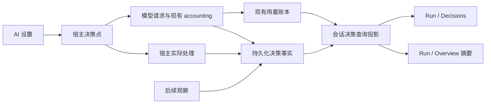

# Decision assistance 与 Run 决策观测专项

日期：2026-10-09。状态：用户确认后已实施；交付与可重复验证见 [专项验收](../verification/session-decisions.md)。

以下保留设计阶段的依据、职责和验收要求。实施后的行为与证据以专项验收文档及源码为准。

## 1. 专项目标与页面职责

用户在设置中配置决策辅助，在当前会话的 Run 中理解决策发生了什么、实际影响了什么、付出了什么代价。

| 位置 | 本次设计 | 用户在这里完成的事 |
| --- | --- | --- |
| Settings → Permissions | 移除独立 Guarded 状态／跳转区块；继续管理实际权限规则 | 查看、调整权限规则 |
| Settings → AI → 高级 → Decision assistance | 保留启用、服务、凭据、模型、调用时限、连接测试和功能开关；移除累计运行统计及其请求 | 决定决策辅助如何工作 |
| 会话权限模式选择器、工作区默认模式 | 保留 Guarded 的实际选择入口及必要的配置定位 | 选择当前／默认权限模式 |
| Run → Decisions（决策） | 新增绑定会话的专项视图 | 查看判断、实际动作、异常与开销，回到相关会话证据 |
| Run → Overview | 增加一条简短决策摘要，点击进入 Decisions | 发现与本会话有关的决策活动 |
| 自动化执行历史 | 承接没有会话归属的条件判断证据 | 解释自动化为何运行或跳过 |

这是一个同时覆盖设置、会话观测和记录语义的专项。实施时以同一个验收边界交付，不能只搬走设置中的数字就宣告完成。

## 2. 已确认的现状与缺口

| 当前事实 | 对方案的影响 |
| --- | --- |
| Permissions 的 Guarded 区块仅展示可用状态、兜底说明和打开 AI 设置的按钮 | 删除这个重复入口合理；不等于删除 Guarded 权限能力 |
| AI 设置在展开决策辅助后调用无参数 `getDecisionUsage()`，并在功能开关下展示统计 | 设置承担了运行观测职责；移除时应连同统计加载、重试及无用状态一起处理 |
| 当前统计 RPC 固定读取当前服务器最近 7 天的全局决策日志 | 更换前端位置不能得到会话统计；必须新增会话范围的数据契约 |
| 底层汇总函数支持 `sessionId` 过滤，但展示 RPC 没有暴露会话参数 | 可以复用部分汇总逻辑，不能直接复用现有全局响应 |
| 决策日志达到 10 MiB 后轮转，读取当前和前一份文件 | 缺失记录不能解释成零；滚动日志不适合作为长期会话历史的唯一来源 |
| 会话已被 SessionManager 管理时，决策调用可通过 accounting 接入持久化运行存储和用量账本 | 后端已有基础；本专项补齐关联、行为事实和展示，不从零另造一套计费 |
| accounting 为每次调用创建独立的辅助 system run；它的 `turnId` 是辅助操作身份 | 不能把辅助调用的 turnId 当成用户对话轮次；需要单独保存触发来源 |
| Run 当前只有 Overview、Trajectory、Context、Map；主体由会话消息建立快照 | 决策需要独立的数据加载路径；没有聊天消息时也可能有决策记录 |
| `DecisionResult.accountingOperationId` 已存在，但 `buildDecisionRecord` 没有把它保存到日志记录 | 两类记录缺少稳定的持久化关联键，不能靠时间接近拼接历史费用 |
| `turnOutcome` 的 `changed` 明确可能只是要求调用方改变；调用方仍会因新轮次、手动状态等丢弃结果 | 现有 `changed` 不能直接命名为“实际生效” |
| 语义标签的多次请求会分别记录同一组匹配结果；大结果筛选只给首个请求记录整体动作 | 模型请求次数与判断事项数必须分开，跨功能直接比较改变率会误导 |
| `openDecisionPoint` 在解析配置失败时直接返回；空结果无法通过现有 outcome API 留下动作记录 | 需要记录“未发起调用／回退处理”，否则最需要解释的异常会从页面消失 |

源码索引见文末。上述判断是静态核对结果，不代表本轮已复现运行故障。

## 3. 设置与 Guarded 的具体调整

### 3.1 Permissions

移除 Guarded 独立区块及该页独有的状态订阅、导航依赖。页面继续使用现有布局，保留权限说明、默认规则、工作区规则和编辑入口。

Guarded 的说明在模式选择器、相关帮助文档及 AI 功能设置中保持可达。权限规则页不再作为进入 AI 页的中转站。

### 3.2 Decision assistance

沿用已经确定的“连接 → 会话 → 高级”结构；决策辅助继续是高级区中的独立折叠项，不增加设置分页。

展开后的顺序：启用开关 → 服务与凭据 → 模型与相关参数 → 连接测试／配置诊断 → 功能分组。

| 保留的信息 | 展示方式 |
| --- | --- |
| 是否启用、有效服务与模型 | 折叠摘要，服务状态按实际检查结果表达 |
| 未配置、凭据不可用、服务不可达 | 就地说明原因和修复动作，区分“可配置”与“可调用” |
| 连接测试结果及本次测试耗时 | 测试操作附近；这是即时诊断，不是累计统计 |
| 功能名称、功能效果、适用场景和开关 | 现有设置行；细节放说明／提示 |
| 必要的数据发送与隐私说明 | 保留简短说明；实现数据源变更后同步文案 |

移除各功能项下的调用数、失败数、改变数、冷调用统计、累计费用、最近 7 天窗口、日志保留提示，以及“至少 30 次未改变，可考虑关闭”一类建议。没有改变不等于没有价值，现有数据也不足以作这种产品判断。

设置与运行记录的关系用一条低权重说明表达：**“会话中的决策记录可在 Run → 决策查看。”** AI 是全局配置页，不提供暗中依赖当前会话的统计跳转。

Guarded 就绪状态只在用户启用该功能、选择该模式或需要修复依赖时突出。没有启用 Guarded 不构成整个决策辅助的错误。

### 3.3 权限行为边界

- 开启 Guarded 功能只使该模式可用，不自动切换现有会话或工作区默认模式。
- 既有 Guarded 会话遇到关闭服务、缺失配置或调用失败时，保持既有人工确认／无人值守阻止的保护行为；本专项不改变权限策略。
- 模型判断与权限执行是两类证据。页面描述“触发确认”“按现有权限规则继续”等实际结果，不把模型答案写成授权。
- 风险标注属于信息辅助，不能显示成“已批准”。只读操作、项目内直接允许的编辑、确定规则直接拦截等未请求模型的路径，不伪造模型调用。
- 关闭功能不隐藏历史；历史记录保留当时的服务、模型和策略事实，不用当前设置重解释。

## 4. Run → Decisions 的信息架构

新增 Run 内部标签，建议顺序：**Overview / Trajectory / Decisions / Context / Map**。不增加顶层工作台面板或全局导航入口。

```text
Run                                      [绑定的会话] [固定／跟随]
Overview  Trajectory  Decisions  Context  Map

当前会话 · 全部记录                         数据覆盖状态

判断事项          实际调整          回退处理          决策开销
事项数            已确认调整的事项数  已确认回退的事项数 已知费用＋未知提示
另列模型请求数                                       Token 明细

功能分布（仅展示本范围内发生过的功能，可折叠）
功能              判断事项          实际动作          开销

决策记录           [功能] [处理结果] [查找]
时间／所属轮次      功能与触发点      实际动作／状态     耗时
点击记录 → 判断依据、实际处理、后续观察、调用与费用、关联证据
```

这是结构示意，不包含真实使用量或效果数据。

### 4.1 会话绑定与范围

- 继承 Run 现有的跟随主会话／固定会话机制。固定在 A 时，切换聊天到 B，Decisions 仍展示 A。
- 默认范围为**绑定会话的全部可用历史**，不继承设置页的 7 天窗口。
- 精确关联到轮次后，允许按轮次筛选；没有来源轮次的记录放在“会话级／未关联轮次”中，不能猜测归入最近一轮。
- 当前会话默认只统计自己。子任务、分支与父会话保持独立，通过关联链接访问；不隐式汇总会话树。
- 数据缓存与请求身份包含服务器、工作区、会话。响应晚到、切换工作区、远程重连均不能串入新范围。
- 关闭功能但有历史时正常展示记录；标签位置保持稳定。没有会话时显示统一的会话选择空态。

### 4.2 页面层次与交互

1. **顶部概览**回答本会话发生了多少判断、实际调整和回退，以及相关开销。采用与现有 Run 一致的紧凑指标行。
2. **功能分布**用于比较本会话用到了哪些能力，不列出所有未触发开关形成大量零值；点击功能即筛选下方记录。
3. **记录列表**默认按最近发生排序、按页加载。筛选维度为功能与处理结果，取消单独可识别；筛选后概览与列表使用相同范围，并显示筛选状态。
4. **记录详情**在宽面板侧边展开，窄面板切换为同一面板内详情，保留返回位置和焦点。
5. **关联证据**有确切 messageId、toolCallId、turnId 等身份时，定位 Chat／Trajectory；只有会话关联时就只提供会话链接。没有证据的定位按钮不显示。
6. **配置入口**在页面菜单及“配置不可用”的空态中提供“配置决策辅助”，定位 AI 页对应折叠项；记录页不复制开关。

详情顺序为：**触发场景 → 模型判断 → 实际处理 → 后续观察 → 调用明细**。默认先展示可理解的动作；模型、阈值、请求身份、Token、费用和时延在诊断区域展开。

“判断依据”仅展示实际保留的结构化答案、阈值与规则匹配事实，不生成模型思维过程，也不补写日志中不存在的理由。

### 4.3 与现有 Run 的联动

| 视图 | 关联方式 |
| --- | --- |
| Overview | 一条决策摘要；有需要注意的回退时给出中性状态，点击进入对应筛选 |
| Trajectory | 有来源身份时显示轻量关联标记／定位入口，不把每次辅助调用伪装成 assistant 消息 |
| Context | Decision Token 计入消费统计，但不加入主模型上下文窗口占用 |
| Map | 继续使用既有会话关系；本专项不引入新的决策拓扑图 |

Decisions 独立加载。当前 TrajectoryPanel 对“消息快照为空”的整页提前返回需要调整，避免只有决策记录、没有聊天消息的会话无法访问新页。

### 4.4 可读性与可访问性

沿用现有字体、颜色、间距和 Run 标签样式。宽度不足时标签横向滚动，列表保留“功能／实际动作／状态”主信息，时间与开销转次行。提供键盘标签切换、明确焦点、详情返回和非颜色状态文本。

实时刷新不抢夺滚动位置或详情焦点；用户查看较早记录时提示有新记录。深浅主题、中文与英文、窄面板均验收，不另做视觉体系改造。

## 5. 记录语义：判断、调用、实际动作

### 5.1 三层身份

| 层级 | 含义 | 去重与统计 |
| --- | --- | --- |
| 判断事项 `decisionPointId` | 某个具体触发点要解决的一件事，例如本轮思考强度选择、一次大结果处理 | 同一事项的批次与重试仍归一个事项 |
| 模型请求 `attemptId` | 该事项发起的某一次实际模型请求 | 重试是新请求；重放已有记录不是新请求；批次分别计数 |
| 处理与观察事件 | 宿主采用了什么动作、是否应用，后来观察到了什么 | 通过事件身份去重，可在请求完成后追加 |

沿用旧 `DecisionRecord.id` 的“单次调用记录”含义，不能直接改成事项身份后混读历史。新字段用版本化契约区分。

配置关闭且根本没有进入决策点，不为每条消息制造“未调用”记录。已经进入实际触发点，却因服务未配置、解析失败、预算限制等无法发起请求时，记录可解释的不可用／回退事实，模型请求数为零。

### 5.2 三种结果不能混用

| 证据层 | 页面表达 | 是否计入实际调整 |
| --- | --- | --- |
| 模型返回了建议 | “建议降低思考强度”“建议转为待处理”等 | 否 |
| 宿主确认应用 | “本轮已使用较低思考强度”“已更新会话状态”等 | 相比当时基线确实改变才计入 |
| 后续观察 | “后续调用了所建议的数据源”“观察到文件访问尝试”等 | 作为独立事实，不重复计入原调整 |

实际处理必须区分：已应用、保持原行为、结果过期被丢弃、按默认路径回退、待处理、没有足够证据。建议没有应用不等于没有记录，也不等于判断失败。

宿主在执行处确认动作及当时基线，不能仅凭 `recordDecisionOutcome()` 返回非空就认定应用成功。同一存储中的动作与事实尽量一起提交；跨存储操作存在确认缺口时标记“处理结果未知”，不补写成功。

例如，轮次结果模型建议“需要输入”，但用户已经开始新一轮：记录“建议需要输入；结果已过期，未更改会话状态”，实际调整数不增加。

### 5.3 统计口径

| 指标 | 定义与限制 |
| --- | --- |
| 判断事项 | 当前范围内不同 decisionPointId 的数量；含实际进入后不可用的事项 |
| 模型请求 | 已进入实际请求阶段的 attempt 数；解析失败／未发送单列，不能混称供应商调用 |
| 实际调整 | 已确认应用、且相对当时明确基线发生改变的事项数；一个事项修改多个标签仍只算一个事项 |
| 保持原行为 | 有宿主结果证据，确认沿用原行为；不吸收未知、过期或仅返回建议的记录 |
| 回退处理 | 因超时、错误、不可用或无法形成可用判断，实际进入既定回退路径的事项数；附原因和动作 |
| 失败、超时、取消 | 请求层分别记录；用户取消不归为供应商可靠性失败；失败与回退可能对应同一事项，不能相加当总数 |
| 已知费用 | 只汇总可信计费事实，并明确未知请求数；全未知时显示“未知”，不是 `$0.00` |
| Token | 分输入／输出展示已报告值，缺报给出覆盖情况；不据缺失值声称零消耗 |
| 调用耗时 | 请求阶段的耗时；分布放诊断区并给样本数。并行请求时长之和不代表用户等待时间 |
| 前台等待 | 只有实际测量到阻塞区间才展示；没有测量就不提供“节省时间” |
| 后续反馈 | 区分观测与推断；“可能发生纠正”不等于模型判断错误，“访问尝试”不等于读取成功 |

不提供统一“准确率／收益率／成功率”评分。模型请求成功只说明请求获得可用响应，不能证明建议正确或用户任务完成。跨功能的改变率也不用于自动建议关闭开关。

现有 `coldStart` 根据首次调用或一段时间没有回答作启发式判断，并非供应商确认的冷启动；如保留，放入诊断并标明其口径。

## 6. 全部功能的观测映射

覆盖当前 13 个功能开关；下面的“实际动作”均要求执行位置确认，旧日志不能自动升级为这些事实。

| 设置功能 | 触发与归属 | Decisions 的主要事实 |
| --- | --- | --- |
| `decideTool` 决策工具 | 智能体工具调用；所属会话与工具请求 | 已返回分类／评分／选择；下游是否采用未知时明确未知，不强行计算实际调整 |
| `suggestions` 技能与数据源建议 | 用户消息；所属会话与轮次 | 建议是否注入智能体上下文；后续是否观察到相关调用，二者分开 |
| `adaptiveThinking` 自适应思考 | 轮次开始；用户请求身份 | 配置基线、建议级别、本轮实际生效级别；过期／取消；后续纠正推断单列 |
| `largeResults` 大结果处理 | 工具返回；所属工具调用 | 采用摘要、预览或筛选结果；同一大结果的多批次请求归一事项；访问原文件属于后续观察 |
| `midTurnMessages` 轮次中消息 | 运行中的新消息与队列项 | 实际转向、排队、合并或沿用既定策略；保留目标消息身份 |
| `turnOutcome` 轮次结果 | 最终回复／任务节点 | 分类建议与实际状态／节点处理分开；用户已操作、新轮次开始、已关闭会话不虚报调整 |
| `smartTitles` 智能标题 | 初次命名或话题偏移 | 延迟命名／请求刷新／保持；真正标题更新作为后续动作，不把分类调用费用与标题生成费用混算 |
| `guardedMode` 受保护模式 | 符合条件的工具操作 | 风险答案、权限处理结果、失败后的确认／阻止；只有真正模型请求计入调用量 |
| `riskBadges` 风险标注 | 权限请求 | 哪些风险说明实际附加到权限请求；不等同于批准、拦截或用户已阅读 |
| `semanticLabels` 语义标签 | 消息匹配语义规则 | 模型匹配与最终新增标签分开；已存在、用户移除、晚到被丢弃均不虚增 |
| `automationConditions` 自动化条件 | 自动化事件；有会话则归事件会话 | 条件判断、实际运行／跳过／回退；不能绑定到当前打开的聊天或尚未生成的目标会话 |
| `taskVerdicts` 任务裁定 | 验证者输出缺失明确裁定；裁定所属会话 | 判读结果、实际采用／重新询问；关联 taskRun 与相关节点，不复制到每个子会话统计 |
| `taskRepairs` 定向修复 | 失败后的修复范围选择；调度所属会话 | 建议范围与实际调度范围；无可靠答案时全范围修复；关联受影响节点 |

无会话的自动化条件判断保留自动化／工作区归属，在已有自动化历史提供原因与必要的记录引用。它不进入任何会话的 Run；本次不建设新的全局统计页，也不为它伪造会话。

## 7. 数据与接入方案

### 7.1 权威数据与存储职责

会话内决策事实进入现有工作区持久化运行存储，增加版本化的决策事件及查询投影。用量继续由 `usage_ledger` 提供，JSONL 保留为兼容诊断来源。



当前会话总量已经可能包含 Decision 用量。Decisions 是其中一项分解，Overview 必须注明“已包含在会话总计中”，不能再把决策费用加一遍。新投影不创建第二套独立费用累计。

### 7.2 必须补齐的记录字段

| 字段组 | 设计要求 |
| --- | --- |
| 身份 | schemaVersion、decisionPointId、attemptId、事件身份、实际 accountingOperationId |
| 归属 | 所属服务器与工作区由宿主验证；会话记录明确 sessionId |
| 触发来源 | sourceTurnId、sourceRunOperationId、messageId、toolCallId、taskRunId／nodeId／automationId 按实际来源填充 |
| 辅助运行 | 辅助 accounting run 身份独立保存，不替代触发来源 |
| 配置快照 | 功能、请求服务／模型、响应模型、适用阈值与规则版本；不保存密钥 |
| 生命周期 | 触发、请求开始、响应／失败、宿主处理、后续观察；时间与状态各有依据 |
| 处理结果 | 建议动作、实际动作、当时基线、是否确认改变、丢弃／回退原因 |
| 用量 | 引用既有账本事实，保留费用来源及未知状态，关联批次和重试 |
| 覆盖与来源 | 新版完整记录／旧版日志／仅费用证据、可用起点、关联完整性 |

没有的字段留空。仅凭时间相近、相同模型、相同文本摘要不能建立确定的轮次或费用关联。

触发与关联身份须在调用前生成并贯穿成功、失败、取消和配置解析失败路径，不能再只把成功结果放进进程内 WeakMap 后等待 outcome。

### 7.3 查询与实时更新

新增会话专用查询契约，返回范围、能力与覆盖状态、同一快照版本的概览、分组、分页记录及继续读取游标。具体 RPC 名称在实现中遵循现有命名，不能让现有全局 `GET_USAGE` 改变含义后静默破坏旧客户端。

- RPC 在服务器端校验会话归属与工作区访问；前端筛选不能替代授权校验。
- 路由跟随面板绑定的会话所在服务器／工作区。远程服务器不支持新能力时显示“不支持此版本的会话决策记录”，不能回退展示全局数据。
- 决策结果、实际动作和后续观察都能通知更新；不能只监听 `usage_update`，因为动作到达时未必有新费用。
- 通过单调游标补齐重连与休眠期间的事件；重复事件、重复提交、分页重叠不增加统计。
- 详情仍打开时，晚到动作更新该记录；切换会话后取消订阅并丢弃旧响应。
- 索引优先覆盖 sessionId、decisionPointId、时间／顺序。列表分页，概览从完整投影取数，不把第一页当成会话总计。
- 页面加载、刷新、重试只读数据，不调用决策模型，不重做已发生的判断。

### 7.4 失败恢复与成本边界

请求未发出、已发出但结果未知、请求失败、用户取消分别记录。崩溃恢复时不能为了填统计自动重试模型请求；不能把未知结果转换成成功或零费用。

现有权限和回退策略保持。决策记录失败不得让 Guarded 自动放行，也不得让已经执行的外部操作再次执行；观测故障通过降级／覆盖状态暴露。

仅记录已有脱敏摘要、结构化答案、原因码和必要标识。错误详情要清理提供商可能回显的内容；本专项不新增保存完整输入、工具结果正文或密钥。

## 8. 历史兼容与会话生命周期

| 情况 | 处理方式 |
| --- | --- |
| 新版有完整身份链 | 提供事项、请求、实际处理和费用联动 |
| 旧日志有可验证 sessionId 和记录 id | 可作为“历史调用记录”读取／幂等导入；保持旧语义，不冒充新版实际调整 |
| 旧日志没有事项／轮次身份 | 显示会话级旧记录，事项数或精确轮次显示未知；不自动把每次请求认作独立事项 |
| 旧日志与用量账本无法确定关联 | 用量按账本计一次；旧日志只提供行为线索，不叠加其中费用、不猜测去重 |
| 只有账本费用，没有决策明细 | 允许看到开销，并明确“缺少历史决策明细” |
| 日志已轮转、记录无唯一归属或缺少稳定 id | 标记覆盖不完整；无法可靠归属的内容继续留在诊断来源，不自动并入会话主统计 |
| 关闭决策辅助／切换模型 | 历史继续可见，当时模型与当前配置分开 |
| 归档会话 | 仍可只读查看历史，不触发模型调用 |
| 分支、复制、导入会话 | 不把继承的历史消费算作新会话再次发生的消费；只有保留真实来源的记录才能关联 |
| 删除会话 | 按现有删除语义清理新增的会话决策投影／明细并撤销读取；晚到事件不能复活已删除会话 |

当前通用运行账本与旧全局日志的保留／清理行为需要在实施时核对。本专项不能把“界面不可访问”写成“所有旧日志已物理清除”，也不以迁移名义删除原始记录。既有自动化无会话记录继续由对应历史／诊断机制管理。

## 9. 必须设计的页面状态

| 状态 | 页面行为 |
| --- | --- |
| 没有绑定会话 | 提示选择会话 |
| 新会话、功能未启用 | 中性空态；提供配置入口，不展示一整页零值 |
| 功能启用但尚未触发 | “本会话尚无决策记录”，不推断服务故障 |
| 功能已关闭但有历史 | 展示历史并用低权重文字标注当前已关闭 |
| 只有辅助决策、消息为空 | 新页仍可访问 |
| 加载中 | 骨架／加载状态，不能先显示零调用 |
| 查询失败／远程断开 | 明确错误与只读重试；旧数据可保留但标注非最新 |
| 旧服务器不支持 | 明确能力缺失，配置功能照常使用 |
| 请求进行中 | 显示处理中；完成后原位更新，不提前计入实际调整 |
| 结果过期／用户取消 | 显示具体终止原因，保留已经发生的调用消费 |
| 服务不可用／超时 | 显示实际回退动作；没有发出请求不增加模型请求数 |
| 未知费用／历史不全 | 使用未知和覆盖说明，不用零替代 |
| 筛选无结果 | 可清除筛选；与“本会话从未调用”区别表达 |
| 记录大量增长 | 分页／虚拟化保持可用，概览不受已加载页数影响 |

## 10. 实施工作包与变更边界

以下是同一专项内的依赖顺序，不代表已开始实施或拆分为多个发布。

| 顺序 | 工作内容 | 主要落点 | 可验收产物 |
| --- | --- | --- | --- |
| 1 | 固定归属、三层记录、指标语义及失败场景 | decisions 共享类型、协议设计、verification 文档 | 版本化契约与失败矩阵，先于实现 |
| 2 | 贯通调用身份、持久化事实、实际动作和后续观察 | shared/decisions、server-core/decisions、SessionManager、任务／自动化调用方 | 完整会话记录，可重复的本地夹具 |
| 3 | 建立只读会话查询、授权、分页、事件更新与兼容 | durable-runtime、RPC、protocol、preload/API、renderer 数据状态 | 正确隔离、去重、费用对账和重连恢复 |
| 4 | 实现 Decisions、Overview 摘要、来源定位与空态 | TrajectoryPanel、TrajectoryView、新决策视图与 WorkbenchFocus | 可操作的会话决策页 |
| 5 | 清理设置统计与 Permissions 重复入口，同步文案和指南 | AiSettingsPage、PermissionsSettingsPage、国际化、内置帮助 | 配置职责集中，模式行为保持 |
| 6 | 完整流程与打包应用验收 | scripts/verification、docs/verification | 可重放脚本、结构化结果和截图证据 |

新的语义写入与回退均遵循当前持久化运行机制。总 Token、总费用和主模型上下文的边界属于本次必要回归；全应用账单面板、权限引擎重写、额外模型策略和跨会话运营看板不纳入本专项。

## 11. 验收矩阵与交付标准

遵守仓库约定：先确定失败场景，优先端到端；不在实现后补写镜像单元测试。本节是验收要求，不是已经通过的结果。

| 验收组 | 必须覆盖的情形与结果 |
| --- | --- |
| 页面职责 | Permissions 无 Guarded 中转区块；AI 各功能无累计统计，也不再调用统计 RPC；连接测试与诊断正常 |
| 模式能力 | Guarded 配置、会话选择、工作区默认值、关闭依赖后的保护逻辑保持 |
| 会话隔离 | A／B 会话切换、固定 A 后切 B、跨工作区、跨服务器、迟到响应均不串数据 |
| 范围与总数 | 全会话／功能／轮次筛选一致；概览基于全部范围，不是第一页；子会话不重复汇总 |
| 13 项功能 | 每项至少覆盖实际采用、保持或不确定、失败回退；补充 decideTool 无下游采用证据的特殊情况 |
| 真实应用 | 模型建议状态改变，但用户已改状态／新轮次开始时显示丢弃，实际调整不增长 |
| 批次与重试 | 标签多批次、大结果多请求、失败重试分别核对事项数、请求数、动作与费用 |
| 前置失败 | 配置缺失／解析失败留下可解释回退记录，不伪造模型请求或费用 |
| 结果与取消 | 超时、断线、用户取消、晚到成功、结果未知分类准确，不把取消算服务失败 |
| 成本一致 | Decision 已含于会话总量，详情、概览与账本可对账；未知不等于零；辅助 Token 不污染上下文占用 |
| 持久性 | 重启、休眠重连、游标补读、重复事件／提交后，已发生事实与统计一致；不开新模型请求 |
| 历史覆盖 | 旧日志、轮转、只有费用、缺身份、不支持的新旧服务器组合均有准确状态 |
| 自动化归属 | 有会话事件归事件会话；无会话条件判断留自动化历史，不挂当前聊天 |
| 生命周期 | 归档可读、分支不复制消费、删除后不可读且晚到事件不复活 |
| 空态与错误 | 无消息有决策、加载、失败、关闭有历史、筛选无结果分别验收 |
| 可访问性与视觉 | 深浅主题、中文／英文与窄面板，键盘切换、筛选、详情返回无溢出或失焦 |
| 性能与隐私 | 大记录集分页可用；不在切换设置或反复渲染时扫描全局日志；输出无新增正文／密钥泄漏 |

验收采用隔离配置、隔离工作区和本地受控决策服务，覆盖确定性成功与故障；产出执行命令、夹具说明、范围与统计断言 JSON、关键截图，以及脱敏的事件／用量关联证据。最后验证实际打包客户端的设置与 Run 路径。

可复用现有 `decision-governance-workflows.ts`、`decision-feature-workflow.ts` 与 AI 设置流程，新增会话决策端到端流程。现有功能夹具通过不能替代新页面与真实数据链路验收。实现后执行相关类型、lint、国际化门禁及仓库要求的检查；推送时不绕过 pre-push。

## 12. 确认后的完成定义

当用户能从任意有权限的会话进入 Run → Decisions，看到范围正确、来源可追溯、实际动作与模型建议分离、与会话总量一致的决策记录，并且配置页只承担配置职责时，这项专项才算完成。

已实施的设计决策：新增稳定的 Run 内部 Decisions 标签；全会话历史为默认范围；保留全部现有决策功能；采用统一记录契约和既有费用账本；旧数据明确降级；无会话自动化不强行归属。

## 源码与既有设计索引

| 主题 | 依据 |
| --- | --- |
| Permissions 重复入口 | [PermissionsSettingsPage.tsx](../../apps/electron/src/renderer/pages/settings/PermissionsSettingsPage.tsx)，Guarded 区块 |
| AI 统计、功能分组与摘要 | [AiSettingsPage.tsx](../../apps/electron/src/renderer/pages/settings/AiSettingsPage.tsx)，`getDecisionUsage`、`decisionUsageNote`、`decisionFeatureGroups` |
| 全局 7 天 RPC | [decisions RPC](../../packages/server-core/src/handlers/rpc/decisions.ts)，`GET_USAGE` |
| 日志结构、轮转与汇总 | [records.ts](../../packages/shared/src/decisions/records.ts)、[usage.ts](../../packages/shared/src/decisions/usage.ts) |
| 现有辅助调用计费 | [accounting.ts](../../packages/server-core/src/decisions/accounting.ts)、[SessionManager.ts](../../packages/server-core/src/sessions/SessionManager.ts)，`registerDecisionAccountingHost` 与 `applyDurableUsageProjection` |
| 总量与上下文边界 | [projection.ts](../../packages/server-core/src/durable-runtime/projection.ts)，`projectDurableUsage` |
| 调用与结果缺口 | [decision-point.ts](../../packages/server-core/src/decisions/decision-point.ts)、[tool-callbacks.ts](../../packages/server-core/src/decisions/tool-callbacks.ts) |
| 建议与实际应用分离 | [turn-outcome.ts](../../packages/server-core/src/decisions/turn-outcome.ts)、SessionManager 的 `applyTurnOutcome` / `applySemanticAutoLabels` |
| 批量语义 | [semantic-labels.ts](../../packages/server-core/src/decisions/semantic-labels.ts)、[large-result-filter.ts](../../packages/server-core/src/decisions/large-result-filter.ts) |
| Guarded 保护行为 | [core/guarded-mode.ts](../../packages/shared/src/agent/core/guarded-mode.ts)、[decisions/guarded-mode.ts](../../packages/server-core/src/decisions/guarded-mode.ts) |
| Run 标签与空态 | [TrajectoryView.tsx](../../packages/ui/src/components/trajectory/TrajectoryView.tsx)、[TrajectoryPanel.tsx](../../apps/electron/src/renderer/components/content-panels/TrajectoryPanel.tsx) |
| 固定／跟随会话 | [ContextWorkbenchTabs.tsx](../../apps/electron/src/renderer/components/app-shell/ContextWorkbenchTabs.tsx) |
| 查询归属校验先例 | [sessions RPC](../../packages/server-core/src/handlers/rpc/sessions.ts)，`assertSessionWorkspaceOwnership` 与 recovery evidence 查询 |
| 既有设置设计 | [AI 设置重新规划](ai-settings-replan.md)、[设置结构验收](../verification/ai-settings-structure.md)；本专项取代其中“Permissions 保留 Guarded 跳转”的设计决定 |
